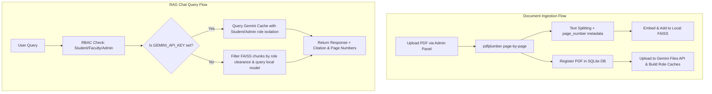

# 🎓 Academic Intelligent Hub — Project Blueprint

This document outlines the core architecture, technical stack, problem statement, and details of the proposed RAG (Retrieval-Augmented Generation) solution.

---

## 📌 1. Problem Statement
Institutions under KTU (APJ Abdul Kalam Technological University) face communication and information fragmentation challenges:
* **Scattered Announcements**: Notices, exam postponements, and holiday alerts are published across multiple separate portals.
* **Fragmented Regulations**: Documents like curriculum rules, activity point mandates, and industrial visit guidelines are distributed in heavy, multi-page PDFs that students and faculty find tedious to search.
* **Data Sovereignty and Speed**: Large PDFs (100+ pages) are slow to search using local hardware, yet uploading them to basic cloud LLMs without proper filters can leak internal institutional documents or result in high server latency.

---

## 🏗️ 2. Proposed Solution
The **Academic Intelligent Hub** is a hybrid on-premise/cloud-caching RAG chatbot and notification feed with Role-Based Access Control (RBAC):
* **Zero-Trust Role Filtering**: Users authenticate as `Student`, `Faculty`, or `Admin`. They can only view announcements and retrieve RAG answers matching their clearance level (e.g., students cannot access confidential faculty salary schemes).
* **Deterministic Citations**: The system parses PDFs page-by-page and tracks page metadata so answers are returned with exact source citations (e.g., `[Source: ktu_activity_points.pdf (Page 3)]`).
* **Google Gemini Context Caching**: Heavy documents (like 100+ page syllabi) are cached on Google Cloud TPUs, dropping response times from **30–50 seconds on local CPU** to **under 1.5 seconds**.

---

## 🛠️ 3. Technical Stack

### Frontend (User Interface)
* **Core Framework**: React 18 (bootstrapped using Vite).
* **Styling**: Vanilla CSS with modern glassmorphism (dark slate theme with glowing highlights inspired by ChatGPT and Gemini interfaces).
* **Router & Auth state**: Inline token checks with browser storage retention.

### Backend (Server API)
* **Core API**: FastAPI (Python 3.10+), running on Uvicorn.
* **Authentication**: JWT Bearer token middleware (`Authorization: Bearer <token>`).
* **PDF Parser**: `pdfplumber` layout-aware parsing (converts tables to Markdown format to retain structure for the LLM).
* **Local Embedding Model**: Sentence-Transformers (`all-MiniLM-L6-v2`) for local vector search.

### Data & Vector Storage
* **Relational Database**: **SQLite** (`academic_hub.db`) tracking user credentials, permanent file locations, and announcements.
* **Vector Store (Local)**: **FAISS** (Facebook AI Similarity Search) index storing text-chunk embeddings for offline fallback.
* **Cloud Cache (Speed Optimization)**: **Google Gemini API** (`CachedContent` model: `gemini-1.5-flash-001`) with automatic 5-hour TTL (Time-to-Live).

---

## 🔄 4. Data Flows & Document Ingestion



### Where Do the Sources Come From?
1. **Official PDF Manuals**: Ingested by the Admin (e.g., `ktu_activity_points.pdf`).
2. **SQLite Database**: Holds the structural parameters (who uploaded it, what folder it is stored in, the clearance level).
3. **Announcements Feed**: Dispatched announcements are instantly vectorized and inserted into the FAISS index so the RAG model knows about real-time alerts.

---

## 🚀 5. How to Run the Project Locally
Open two separate terminal windows in your project directory:

### Terminal 1 (FastAPI Backend)
```powershell
# Set your key to unlock the 1-second cloud RAG cache (Optional but highly recommended)
$env:GEMINI_API_KEY="AIzaSy..."

# Run the python server
python backend/run.py
```

### Terminal 2 (React Frontend)
```powershell
cd frontend
npm run dev
```
Open **`http://localhost:3000`** in your browser.

### Credentials for testing:
* **Admin**: `admin` / `admin123`
* **Faculty**: `faculty` / `faculty123`
* **Student**: `student` / `student123`
